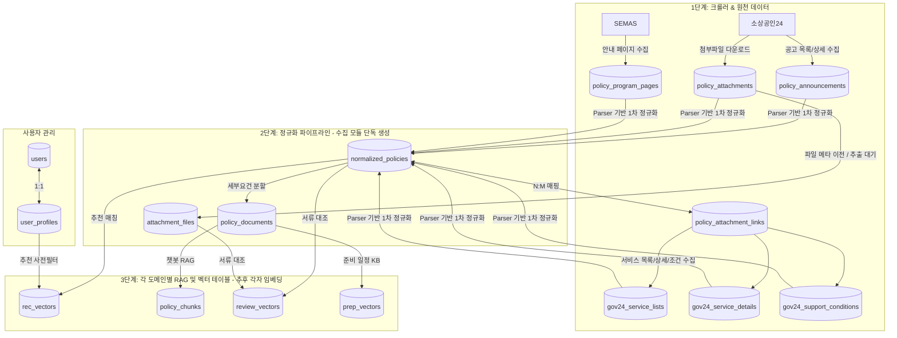

# 🍲 소복소복 DB 스키마 및 데이터 흐름 가이드

이 문서는 **소복소복 (SobokSobok)** 모바일 웹 백엔드의 PostgreSQL 16 + pgvector 데이터베이스 설계 및 각 도메인별 데이터 소유권(역할 경계)을 설명합니다.

---

## 🔄 데이터 흐름도 (RAG & 파이프라인 아키텍처)



---

## 🔑 공유 계약 및 테이블 역할 요약

| 테이블명 | 소유자 (도메인) | 역할 및 설명 | 주요 연동 정보 |
| :--- | :--- | :--- | :--- |
| **`users`** | 공통 (인증) | JWT 인증 및 구글 OAuth 연동을 위한 계정 정보 | - |
| **`user_profiles`** | 공통 (추천) | 추천 서비스의 맞춤 정책 사전 필터링용 사용자 정보 (업종, 지역, 매출액, 직원수 등) | `users.id` |
| **`normalized_policies`** | **수집 파이프라인** (생성)<br>전체 서비스 (소비) | **공유 계약 #2** - 수집된 원본을 가공한 정규화 공고 본문 및 구조화 데이터 (`eligibility`, `required_documents`) | `source_pk` |
| **`attachment_files`** | 서류 검토 / 공통 | 다운로드된 첨부파일 메타 및 OCR/텍스트 추출 본문 보관 | `file_hash` |
| **`policy_attachment_links`** | 수집 파이프라인 / 공통 | 정규화 공고와 첨부파일의 N:M 연결 | `normalized_policies.id`, `attachment_files.id` |
| **`policy_documents`** | 공통 (RAG) | 정규화 공고의 본문을 특정 세부 조건이나 가이드 단위로 분할한 데이터 | `normalized_policies.id` |
| **`policy_chunks`** | **챗봇 RAG** | 챗봇 대화 시 사용될 텍스트 조각(Chunk)과 **pgvector** 임베딩 값 보관 | `policy_documents.id` |
| **`rec_vectors`** | **추천 서비스** | 사용자의 프로필 조건 임베딩과 매칭하기 위한 정책별 **pgvector** 추천 벡터 | `normalized_policies.id` |
| **`review_vectors`** | **서류 검토** | 업로드 서류 OCR 결과와 대조할 필수 서류명 기반 **pgvector** 요건 벡터 | `normalized_policies.id` |
| **`prep_vectors`** | **일정 관리** | 구비 서류명에 대응하는 발급 프로세스/소요기간 안내 지식베이스 **pgvector** 벡터 | - |

---

### 세부 테이블 컬럼 명세 (물리 스키마)

#### 1. 사용자 / 인증 도메인
* **`users` (사용자 마스터)**
  - `id` (INTEGER, PK): 자동 증가 고유 식별값
  - `email` (VARCHAR(255), UNIQUE, INDEX): 사용자 계정 이메일
  - `hashed_password` (VARCHAR(255), NULLABLE): 암호화된 비밀번호 (구글 로그인 시 NULL)
  - `is_active` (BOOLEAN): 활성화 여부
  - `created_at` / `updated_at` (TIMESTAMPTZ)
* **`user_profiles` (추천 전처리 프로필)**
  - `id` (INTEGER, PK): 고유 식별값
  - `user_id` (INTEGER, FK -> `users.id`): 1:1 사용자 매핑
  - `industry` (JSON, NULLABLE): 선택 업종 태그 리스트 (예: `["음식점업", "제조업"]`)
  - `region` (VARCHAR(255), NULLABLE): 주소 지역 (예: `"서울특별시 마포구"`)
  - `sales` (INTEGER, NULLABLE): 연 매출액 수치값
  - `employees` (INTEGER, NULLABLE): 상시 근로자 수
  - `available_time_preference` (JSON, NULLABLE): 사용자 가용시간 설정 데이터
  - `created_at` / `updated_at` (TIMESTAMPTZ)

#### 2. 정규화 공용 공유 도메인
* **`normalized_policies` (정규화 통합 정책)**
  - `id` (UUID, PK): 정책 고유 식별 UUID
  - `source` / `source_pk` (VARCHAR, UNIQUE): 수집원 분류 및 원천 고유 키
  - `canonical_key` / `duplicate_group_key` (TEXT): 중복 공고 바인딩 및 분류 식별 키
  - `title` / `summary` / `body` (TEXT): 공고 제목, 요약, 상세 본문
  - `organization` (TEXT): 소관 기관명
  - `support_type` (VARCHAR): 지원 유형
  - `target_text` / `support_content` (TEXT): 대상 및 혜택 설명 텍스트
  - `region_scope` / `sido` / `sigungu` (VARCHAR): 지역 범위 및 시도/시군구 명칭
  - `matched_sidos` (JSON, GIN INDEX): 권역 공고까지 다 풀어놓은 허용 시도 리스트
  - `region_confidence` (DOUBLE PRECISION): 지역 정보 추출 신뢰도 점수
  - `status` (VARCHAR): 접수중/마감 등의 신청 상태
  - `apply_start` / `apply_end` (TIMESTAMP): 신청 시작일 및 마감일
  - `apply_url` (TEXT): 신청 온라인 URL
  - `application_methods` (JSON, GIN INDEX): 온라인/방문 등 신청 방법 목록
  - `contact_points` (JSON): 문의처 번호 리스트
  - `employee_limit_value` / `employee_limit_operator` (INT / VARCHAR): 상시 근로자 수 상한 제한 조건
  - `sales_limit_amount_krw` / `sales_limit_operator` (BIGINT / VARCHAR): 연 매출액 제한 조건
  - `business_age_limit_value` / `business_age_limit_operator` (INT / VARCHAR): 창업 제한 연차 조건
  - `required_document_count` (INTEGER): 필수 구비 서류 개수
  - `has_required_documents` (BOOLEAN): 구비 서류 포함 여부 플래그
  - `industry_tags` / `business_status_tags` (JSON, GIN INDEX): 정제 업종 및 상태 태그
  - `eligibility` (JSON): 추천 사전필터 및 상세 조건 구조화 문서
  - `required_documents` (JSON): 필수 제출 서류 목록 구조화 정보
  - `is_active` (BOOLEAN): 노출 활성화 여부
* **`policy_documents` (의미 단위 분할 문서)**
  - `id` (UUID, PK)
  - `policy_id` (UUID, FK -> `normalized_policies.id`): 1:N 관계 매핑
  - `document_type` (VARCHAR): RAG 단락 분류 (eligibility, requirements 등)
  - `source_ref` / `title` (TEXT): 원본 참조 번호 및 단락 제목
  - `text` (TEXT): 쪼개진 단락 텍스트 본문
  - `text_hash` (TEXT): 본문 중복 방지용 해시
* **`attachment_files` (첨부파일 정보 및 추출 텍스트)**
  - `id` (UUID, PK)
  - `file_hash` (VARCHAR(255), UNIQUE): 파일 무결성 해시
  - `storage_path` (TEXT): 로컬 스토리지 물리적 저장 위치
  - `original_file_name` (TEXT): 업로드 원본 파일명
  - `content_type` / `file_size` (VARCHAR / BIGINT): MIME 타입 및 파일 크기
  - `extracted_text` (TEXT): OCR 또는 파일 파서로 추출해 낸 본문 텍스트 (서류 진단에 활용)
  - `extraction_status` (VARCHAR): 추출 상태 (pending, success, failed)
* **`policy_attachment_links` (공고-첨부파일 N:M 관계 매핑)**
  - `id` (UUID, PK)
  - `policy_id` (UUID, FK -> `normalized_policies.id`)
  - `attachment_file_id` (UUID, FK -> `attachment_files.id`)
  - `source_file_id` / `original_file_name` (TEXT)
  - `display_order` (INTEGER): 정렬 순서

#### 3. 개별 벡터 도메인 (각 RAG 서비스용 pgvector)
* **`rec_vectors` (안주현 추천 서비스)**
  - `id` (UUID, PK)
  - `policy_id` (UUID, FK -> `normalized_policies.id`, UNIQUE): 1:1 관계
  - `embedding` (VECTOR): pgvector 추천 벡터값
* **`policy_chunks` (김정연 챗봇 RAG)**
  - `id` (UUID, PK)
  - `policy_id` (UUID, FK -> `normalized_policies.id`)
  - `document_id` (UUID, FK -> `policy_documents.id`): 1:N 관계
  - `chunk_index` (INTEGER): 쪼개진 순서 번호
  - `chunk_text` (TEXT): 쪼개진 텍스트 본문 (청크)
  - `chunk_hash` (VARCHAR(255)): 중복 방지용 해시
  - `metadata` (JSON): 메타데이터 (생성 모델 정보 등)
  - `embedding_status` / `embedding_model` (VARCHAR / TEXT)
  - `embedding` (VECTOR): pgvector 챗봇 RAG 벡터값
* **`review_vectors` (이충헌 서류 검토)**
  - `id` (UUID, PK)
  - `policy_id` (UUID, FK -> `normalized_policies.id`)
  - `document_name` (VARCHAR(255)): 필수 구비 서류 명칭
  - `embedding` (VECTOR): pgvector 대조 임베딩
* **`prep_vectors` (이재혁 일정 관리)**
  - `id` (UUID, PK)
  - `document_name` (VARCHAR(255), INDEX): 가이드 대상 서류명
  - `guide_text` (TEXT): 발급 팁 및 소요 기간 설명 텍스트
  - `embedding` (VECTOR): pgvector 가이드 임베딩

---

## 🚦 실행 순서와 책임 경계

Docker Compose 기준 실행 순서는 다음을 목표로 합니다.

```text
api 컨테이너 시작
-> FastAPI startup에서 DB 테이블 생성
-> crawler 컨테이너 시작
-> sbiz24 / semas / gov24 원천 데이터 수집
-> normalize_policy_sources_once 실행
-> normalized_policies / attachment_files / policy_documents 갱신
-> 추후 각 도메인별 임베딩 job 실행
```

현재 자동화된 범위는 **정규화까지**입니다. 임베딩 생성은 아직 붙이지 않습니다.

역할 경계는 아래처럼 고정합니다.

```text
수집/정규화 담당
- raw 원천 테이블 쓰기
- normalized_policies, attachment_files, policy_attachment_links, policy_documents 쓰기
- 벡터 테이블에는 쓰지 않음

추천 담당
- normalized_policies, user_profiles 읽기
- rec_vectors 쓰기

챗봇/RAG 담당
- policy_documents 읽기
- policy_chunks 쓰기

서류 검토 담당
- normalized_policies.required_documents, attachment_files 읽기
- review_vectors 쓰기

일정/준비 담당
- normalized_policies.required_documents, policy_documents 읽기
- prep_vectors 쓰기
```

원칙은 **공유하는 것은 텍스트/JSON 정규화 데이터이고, 각자 소유하는 것은 벡터**입니다. 서로 다른 임베딩 모델을 써도 되지만, 서로의 벡터를 섞어 검색하지 않습니다.

---

## 🧩 정규화 출력 계약 (고도화 스펙 반영)

정규화 파이프라인은 세 원천을 아래 기준으로 `normalized_policies`와 `policy_documents`에 맞춥니다.

```text
Gov24
- gov24_service_lists + gov24_service_details + gov24_support_conditions를 service_id로 조인
- 상세의 지원대상/지원내용/신청방법/신청기한/구비서류를 반영
- 지원조건 코드(JA*)는 industry_tags, business_status_tags, eligibility.support_condition_labels, age, income_ranges, target_traits로 반영

Sbiz24
- policy_announcements의 title/target/category/content_text/apply 기간을 기준으로 정규화
- 본문 표제(지원대상, 지원내용, 신청방법, 문의처, 신청서류 등)를 rule 기반으로 section 분리
- 첨부파일은 attachment_files / policy_attachment_links의 file_hash, storage_path, original_file_name으로 연결

SEMAS
- policy_program_pages.sections_json의 HTML 섹션을 표준 document_type으로 매핑
- breadcrumbs/category/program_name/content_text를 함께 사용해 업종, 대상 상태, 신청방법, 연락처를 보강
```

### A. 추천 사전필터 및 고속 쿼리용 정규화 신규 컬럼 (Flat Columns)
안주현 님의 추천 사전필터 대소 비교 연산과 고속 검색 GIN 인덱스를 태우기 위해, `normalized_policies` 테이블에 아래 컬럼들이 정형화되어 저장됩니다.

| 컬럼명 | 데이터 타입 | 설명 | 예시 |
| :--- | :--- | :--- | :--- |
| **`matched_sidos`** | `JSON (ARRAY)` | 권역 표현까지 다 풀어서 정규화된 적용 가능 시도 목록 | `["서울특별시", "경기도"]` |
| **`region_confidence`** | `DOUBLE` | 지역 파싱 신뢰도 점수 (국가/지역 매칭 여부) | `0.85` |
| **`application_methods`** | `JSON (ARRAY)` | 정규화된 신청 방식 태그 리스트 | `["online", "visit"]` |
| **`contact_points`** | `JSON (ARRAY)` | 문의처 전화번호 목록 | `["02-123-4567"]` |
| **`employee_limit_value`** | `INTEGER` | 상시근로자수 제한 수치값 | `5` |
| **`employee_limit_operator`** | `VARCHAR(10)` | 상시근로자수 제한 비교 연산자 | `<` (미만) / `<=` (이하) |
| **`sales_limit_amount_krw`**| `BIGINT` | 연간 매출액 제한값 (원 단위 변환) | `300000000` (3억 원) |
| **`sales_limit_operator`** | `VARCHAR(10)` | 매출액 제한 비교 연산자 | `<=` |
| **`business_age_limit_value`**| `INTEGER` | 창업/업력 제한 연차값 | `7` (7년) |
| **`business_age_limit_operator`**| `VARCHAR(10)`| 창업/업력 제한 비교 연산자 | `<=` (이내/이하) |
| **`required_document_count`**| `INTEGER` | 정형화된 필수 구비서류 개수 | `3` |
| **`has_required_documents`** | `BOOLEAN` | 필수 제출서류가 텍스트에 포함되어 있는지 여부 | `true` |

### B. `eligibility` JSON 상세 구조
추천 사전필터와 임베딩 job이 공통으로 상세 구조를 조회할 수 있게 아래 필드를 포함합니다.

```text
region
- region_scope: national/local/unknown
- sido, sigungu
- matched_sidos: 권역 표현을 여러 시도로 푼 리스트
- confidence, extraction_method

business_status_tags
industry_tags
employee_limit
- value, operator, unit, source_text
sales_limit
- amount_krw, operator, source_text
business_age_limit
- value, operator, unit, source_text ("~년이 경과하지 않은 자" 등의 엣지 케이스 포함)
money_conditions
application_methods
contacts
```

---

## 🧩 RAG용 문서 분리 및 적재 샘플 (`policy_documents`)

`policy_documents.document_type`은 임베딩 전 공통 문서 단위입니다.

```text
summary         (요약 / 사업목적)
support_content (지원 내용 및 혜택 규모)
eligibility     (지원 대상 및 조건)
application     (신청 방법 및 신청 접수처)
deadline        (신청 기간 및 제출 마감일)
requirements    (필수 구비 서류 목록)
contact         (문의처 연락처 및 전화번호)
procedure       (추진 절차 및 단계)
reference       (관련 법령 및 참조)
body            (공고문 본문 전체 백업)
section         (기타 일반 세부 섹션)
```

### 💡 실제 테이블 적재 데이터 예시 (`우리동네 크라우드 펀딩` 공고 기준)

| document_type | title (소제목) | text (실제 텍스트 조각) |
| :--- | :--- | :--- |
| **`summary`** | 사업목적 | 소상공인에 적합한 크라우드펀딩 모델을 개발 운영하여 우리동네 소상공인 대상으로 자금을 조달... |
| **`support_content`** | 지원규모 | 1,333개사 이상 * 펀딩성공업체 기준 |
| **`eligibility`** | 지원대상 | 소상공인(소상공인기본법 2조) |
| **`support_content`** | 지원내용 | 크라우드펀딩 교육·코칭, 펀딩수수료 등 제반사항 지원... |
| **`procedure`** | 지원절차 | 01 모집 및 선발 ➔ 02 코칭·교육 전문가 코칭 ➔ 03 펀딩... |
| **`application`** | 신청·접수 | 지정된 펀딩 플랫폼사를 통한 메일 또는 온라인 신청... |
| **`contact`** | 문의처 | (기업가형소상공인육성팀) 042-363-7724, 7727 |

각 도메인은 이 분할된 조각 문서들을 자기 RAG 목적에 맞게 읽어와 임베딩합니다.

```text
추천: normalized_policies + eligibility/summary/support_content 문서
챗봇 RAG: policy_documents 전체 (Parent-Child Retriever 구성 권장)
서류검토: required_documents + requirements 문서 + attachment_files
일정/준비: deadline/application/requirements/contact 문서
```

`required_documents`는 확실한 구비서류만 보수적으로 채웁니다. Sbiz24/SEMAS에서 서류가 첨부파일 내부에만 있거나 본문 문맥이 애매한 경우에는 빈 배열일 수 있으며, 이 경우 추후 첨부파일 parser/OCR job이 `attachment_files.extracted_text`를 채운 뒤 보강합니다.

---

## 🧠 pgvector(벡터) 설정 및 변경 방법

현재 코드의 벡터 컬럼은 임시로 **설정값 `settings.EMBEDDING_DIM` (기본 `1536`)** 하나를 공유합니다. 다만 팀 기획상 최종 구조는 각 도메인이 자기 임베딩 모델과 벡터 테이블을 소유하는 방식입니다.

임베딩 모델을 확정하기 전까지는 `rec_vectors`, `policy_chunks`, `review_vectors`, `prep_vectors`를 자동 생성/적재하지 않습니다. 추후 각자 다른 모델을 사용한다면 도메인별 차원 설정으로 분리하는 것을 권장합니다.

예시:

```env
REC_EMBEDDING_DIM=1536
CHAT_EMBEDDING_DIM=768
REVIEW_EMBEDDING_DIM=1536
PREP_EMBEDDING_DIM=384
```

현재 `EMBEDDING_DIM`을 변경해 벡터 차원을 바꿀 때는 기존 DB 볼륨을 유지하면 테이블 차원이 자동 변경되지 않습니다. 개발 DB를 새로 만들 수 있을 때만 아래처럼 재생성합니다.

```powershell
docker compose down -v
docker compose up -d --build
```
