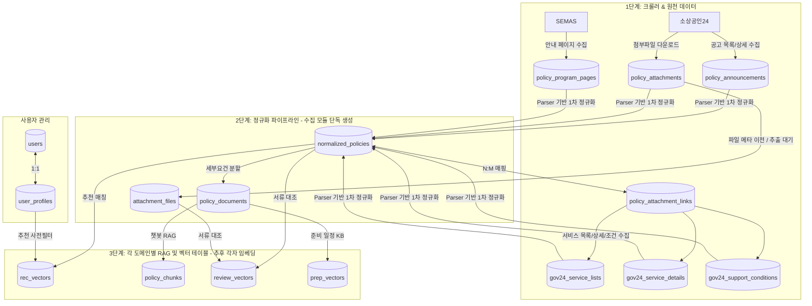

# 🍲 소복소복 DB 스키마 및 데이터 흐름 가이드

이 문서는 **소복소복 (SobokSobok)** 모바일 웹 백엔드의 PostgreSQL 16 + pgvector 데이터베이스 설계 및 각 도메인별 데이터 소유권(역할 경계)을 설명합니다.

---

## 🔄 데이터 흐름도 (RAG & 파이프라인 아키텍처)



---

## 🔑 공유 계약 및 테이블 역할 요약

| 테이블명 | 소유자 (도메인) | 역할 및 설명 | 주요 연동 정보 |
| :--- | :--- | :--- | :--- |
| **`users`** | 공통 (인증) | JWT 인증 및 구글 OAuth 연동을 위한 계정 정보 | - |
| **`user_profiles`** | 공통 (추천) | 추천 서비스의 맞춤 정책 사전 필터링용 사용자 정보 (업종, 지역, 매출액, 직원수 등) | `users.id` |
| **`normalized_policies`** | **수집 파이프라인** (생성)<br>전체 서비스 (소비) | **공유 계약 #2** - 수집된 원본을 가공한 정규화 공고 본문 및 구조화 데이터 (`eligibility`, `required_documents`) | `source_pk` |
| **`attachment_files`** | 서류 검토 / 공통 | 다운로드된 첨부파일 메타 및 OCR/텍스트 추출 본문 보관 | `file_hash` |
| **`policy_attachment_links`** | 수집 파이프라인 / 공통 | 정규화 공고와 첨부파일의 N:M 연결 | `normalized_policies.id`, `attachment_files.id` |
| **`policy_documents`** | 공통 (RAG) | 정규화 공고의 본문을 특정 세부 조건이나 가이드 단위로 분할한 데이터 | `normalized_policies.id` |
| **`policy_chunks`** | **챗봇 RAG** | 챗봇 대화 시 사용될 텍스트 조각(Chunk)과 **pgvector** 임베딩 값 보관 | `policy_documents.id` |
| **`rec_vectors`** | **추천 서비스** | 사용자의 프로필 조건 임베딩과 매칭하기 위한 정책별 **pgvector** 추천 벡터 | `normalized_policies.id` |
| **`review_vectors`** | **서류 검토** | 업로드 서류 OCR 결과와 대조할 필수 서류명 기반 **pgvector** 요건 벡터 | `normalized_policies.id` |
| **`prep_vectors`** | **일정 관리** | 구비 서류명에 대응하는 발급 프로세스/소요기간 안내 지식베이스 **pgvector** 벡터 | - |

---

## 🚦 실행 순서와 책임 경계

Docker Compose 기준 실행 순서는 다음을 목표로 합니다.

```text
api 컨테이너 시작
-> FastAPI startup에서 DB 테이블 생성
-> crawler 컨테이너 시작
-> sbiz24 / semas / gov24 원천 데이터 수집
-> normalize_policy_sources_once 실행
-> normalized_policies / attachment_files / policy_documents 갱신
-> 추후 각 도메인별 임베딩 job 실행
```

현재 자동화된 범위는 **정규화까지**입니다. 임베딩 생성은 아직 붙이지 않습니다.

역할 경계는 아래처럼 고정합니다.

```text
수집/정규화 담당
- raw 원천 테이블 쓰기
- normalized_policies, attachment_files, policy_attachment_links, policy_documents 쓰기
- 벡터 테이블에는 쓰지 않음

추천 담당
- normalized_policies, user_profiles 읽기
- rec_vectors 쓰기

챗봇/RAG 담당
- policy_documents 읽기
- policy_chunks 쓰기

서류 검토 담당
- normalized_policies.required_documents, attachment_files 읽기
- review_vectors 쓰기

일정/준비 담당
- normalized_policies.required_documents, policy_documents 읽기
- prep_vectors 쓰기
```

원칙은 **공유하는 것은 텍스트/JSON 정규화 데이터이고, 각자 소유하는 것은 벡터**입니다. 서로 다른 임베딩 모델을 써도 되지만, 서로의 벡터를 섞어 검색하지 않습니다.

---

## 🧠 pgvector(벡터) 설정 및 변경 방법

현재 코드의 벡터 컬럼은 임시로 **설정값 `settings.EMBEDDING_DIM` (기본 `1536`)** 하나를 공유합니다. 다만 팀 기획상 최종 구조는 각 도메인이 자기 임베딩 모델과 벡터 테이블을 소유하는 방식입니다.

임베딩 모델을 확정하기 전까지는 `rec_vectors`, `policy_chunks`, `review_vectors`, `prep_vectors`를 자동 생성/적재하지 않습니다. 추후 각자 다른 모델을 사용한다면 도메인별 차원 설정으로 분리하는 것을 권장합니다.

예시:

```env
REC_EMBEDDING_DIM=1536
CHAT_EMBEDDING_DIM=768
REVIEW_EMBEDDING_DIM=1536
PREP_EMBEDDING_DIM=384
```

현재 `EMBEDDING_DIM`을 변경해 벡터 차원을 바꿀 때는 기존 DB 볼륨을 유지하면 테이블 차원이 자동 변경되지 않습니다. 개발 DB를 새로 만들 수 있을 때만 아래처럼 재생성합니다.

```powershell
docker compose down -v
docker compose up -d --build
```
