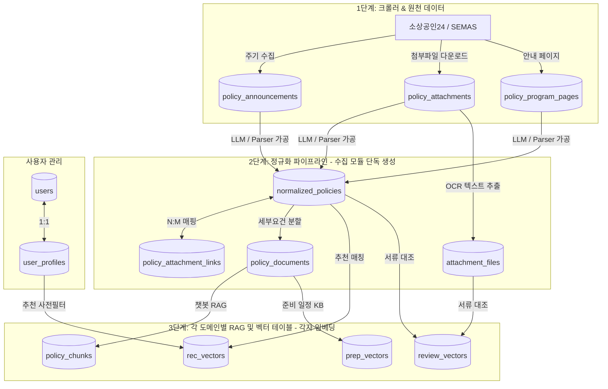

# 🍲 소복소복 DB 스키마 및 데이터 흐름 가이드

이 문서는 **소복소복 (SobokSobok)** 모바일 웹 백엔드의 PostgreSQL 16 + pgvector 데이터베이스 설계 및 각 도메인별 데이터 소유권(역할 경계)을 설명합니다.

---

## 🔄 데이터 흐름도 (RAG & 파이프라인 아키텍처)



---

## 🔑 공유 계약 및 테이블 역할 요약

| 테이블명 | 소유자 (도메인) | 역할 및 설명 | 주요 연동 정보 |
| :--- | :--- | :--- | :--- |
| **`users`** | 공통 (인증) | JWT 인증 및 구글 OAuth 연동을 위한 계정 정보 | - |
| **`user_profiles`** | 공통 (추천) | 추천 서비스의 맞춤 정책 사전 필터링용 사용자 정보 (업종, 지역, 매출액, 직원수 등) | `users.id` |
| **`normalized_policies`** | **수집 파이프라인** (생성)<br>전체 서비스 (소비) | **공유 계약 #2** - 수집된 원본을 가공한 정규화 공고 본문 및 구조화 데이터 (`eligibility`, `required_documents`) | `source_pk` |
| **`attachment_files`** | 서류 검토 / 공통 | 다운로드된 첨부파일 메타 및 OCR/텍스트 추출 본문 보관 | `file_hash` |
| **`policy_documents`** | 공통 (RAG) | 정규화 공고의 본문을 특정 세부 조건이나 가이드 단위로 분할한 데이터 | `normalized_policies.id` |
| **`policy_chunks`** | **챗봇 RAG** | 챗봇 대화 시 사용될 텍스트 조각(Chunk)과 **pgvector** 임베딩 값 보관 | `policy_documents.id` |
| **`rec_vectors`** | **추천 서비스** | 사용자의 프로필 조건 임베딩과 매칭하기 위한 정책별 **pgvector** 추천 벡터 | `normalized_policies.id` |
| **`review_vectors`** | **서류 검토** | 업로드 서류 OCR 결과와 대조할 필수 서류명 기반 **pgvector** 요건 벡터 | `normalized_policies.id` |
| **`prep_vectors`** | **일정 관리** | 구비 서류명에 대응하는 발급 프로세스/소요기간 안내 지식베이스 **pgvector** 벡터 | - |

---

## 🧠 pgvector(벡터) 설정 및 변경 방법

현재 생성된 모든 벡터 테이블(`policy_chunks`, `rec_vectors`, `review_vectors`, `prep_vectors`)은 **기본 `1536` 차원**(`pgvector.sqlalchemy.Vector(1536)`)으로 세팅되어 있습니다.

만약 다른 임베딩 모델(예: HuggingFace 384 또는 768 차원 등)을 사용하고자 한다면, 본인이 담당하는 Python 파일 내에서 차원 수만 간단히 수정하시면 됩니다.

### 예시: `recommend.py`에서 768차원 모델로 변경 시
```python
# recommend.py 수정
class RecommendationVector(Base):
    __tablename__ = "rec_vectors"
    
    # ...
    # 기존 Vector(1536)에서 원하는 차원으로 수정
    embedding = Column(Vector(768), nullable=False) 
```

그 후 아래 도커 명령어를 통해 볼륨을 삭제하고 다시 컴포즈 업하시면 자동으로 변경된 차원수로 데이터베이스 테이블이 재생성됩니다.
```powershell
docker compose down -v
docker compose up -d --build
```
