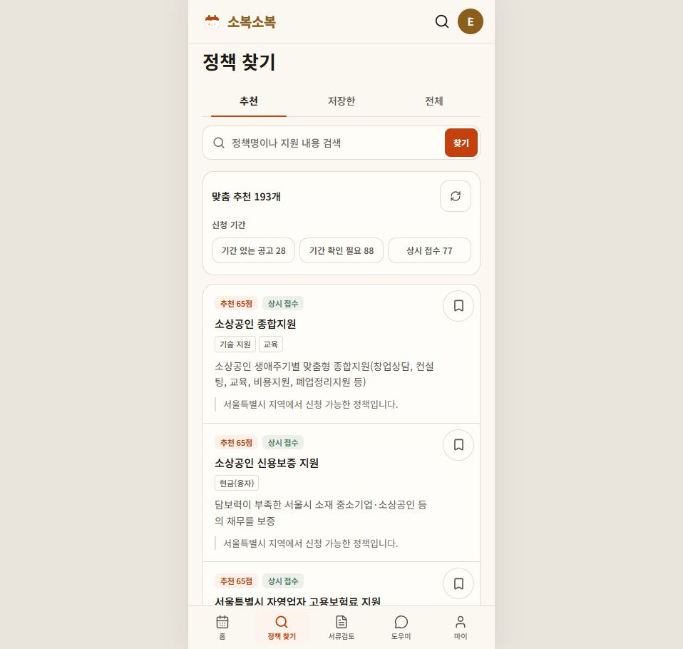
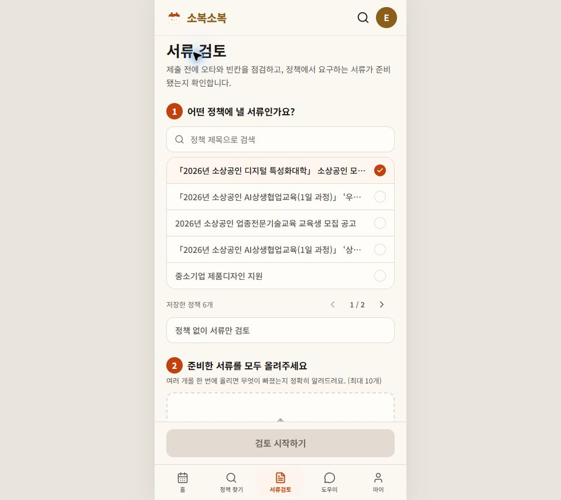
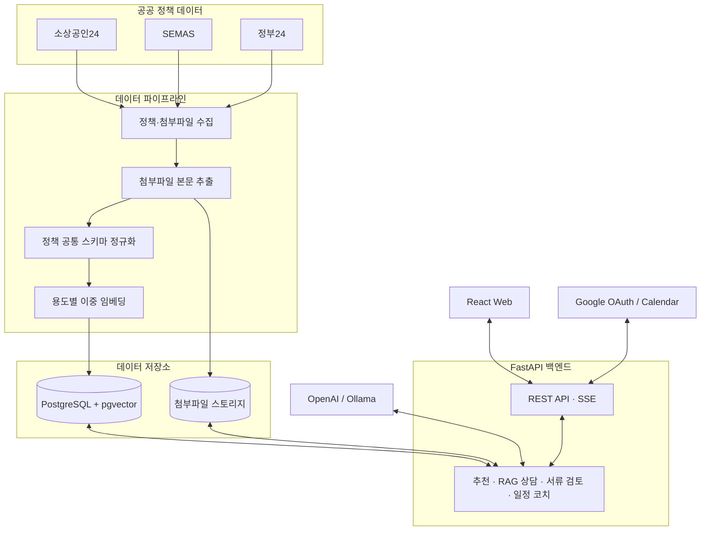

<div align="center">
  

  <h1>소복소복 (SobokSobok)</h1>

  <p>
    <strong>흩어진 소상공인 지원정책을 한곳에 모아,<br />
    발견부터 신청 준비까지 함께하는 맞춤형 정책 도우미</strong>
  </p>

  <p>
    
    
    
    
    
  </p>

  <p>
    <a href="#-서비스-화면">서비스 화면</a> ·
    <a href="#-주요-기능">주요 기능</a> ·
    <a href="#-서비스-구조">서비스 구조</a> ·
    <a href="#-빠른-시작">빠른 시작</a> ·
    <a href="#-프로젝트-구조">프로젝트 구조</a>
  </p>
</div>

---

## 소복소복은

소상공인 지원사업은 여러 기관에 흩어져 있고, 공고마다 표현 방식도 달라 나에게 맞는
정책을 찾고 제출 서류와 마감일을 관리하기 어렵습니다.

소복소복은 **소상공인24, 소상공인시장진흥공단(SEMAS), 정부24**의 정책 공고를 수집하고
하나의 형식으로 정리합니다. 사용자의 사업장 정보에 맞는 정책을 추천하고, 근거가 있는
AI 답변과 일정·서류 관리 기능으로 실제 신청 준비까지 이어 줍니다.

## 📱 서비스 화면

<table>
  <tr>
    <th align="center">내 정책 달력</th>
    <th align="center">맞춤 정책 추천</th>
    <th align="center">제출 서류 검토</th>
  </tr>
  <tr>
    <td>
      
    </td>
    <td>
      
    </td>
    <td>
      
    </td>
  </tr>
  <tr>
    <td align="center">저장한 정책과 마감일을 한눈에</td>
    <td align="center">사업장 조건에 맞는 정책과 추천 이유</td>
    <td align="center">요구 서류 대조와 누락 항목 확인</td>
  </tr>
</table>

## ✨ 주요 기능

| 기능 | 설명 |
| --- | --- |
| **정책 통합 수집** | 여러 공공기관의 공고와 첨부파일을 주기적으로 수집하고 공통 스키마로 정규화합니다. |
| **맞춤 정책 추천** | 지역, 업종, 사업장 규모 등 사용자 프로필을 바탕으로 신청 가능한 정책과 추천 이유를 제공합니다. |
| **정책 AI 상담** | 전체 정책을 검색하거나 선택한 정책의 원문을 근거로 후속 질문에 답합니다. 답변은 SSE로 실시간 스트리밍됩니다. |
| **마감일 캘린더** | 저장한 정책의 실제 접수 마감일을 관리하고 Google Calendar와 연동합니다. |
| **AI 신청 코치** | 정책 마감일, 필요한 준비 기간, 개인 일정을 조합해 단계별 신청 준비 일정을 제안합니다. |
| **제출 서류 검토** | 업로드한 서류를 로컬에서 파싱한 뒤 정책 요구사항과 대조하고, 누락 항목과 발급 방법을 안내합니다. |
| **클라우드·로컬 AI 선택** | 챗봇, 추천, 요약, 일정 코치, 서류 검토별로 OpenAI 또는 Ollama를 선택할 수 있습니다. |

## 🔄 이용 흐름

```text
Google 로그인
  → 사업장 프로필 등록
  → 맞춤 정책 탐색·저장
  → 정책 상세 확인 및 AI 상담
  → 마감 일정 등록
  → 제출 서류 검토와 신청 준비
```

## 🏗 서비스 구조



정책 원문과 용도별 벡터는 PostgreSQL에 함께 저장합니다. 클라우드와 로컬 임베딩은
서로 다른 컬럼으로 관리해 모델별 차원이 섞이지 않으며, 변경되거나 누락된 데이터만
증분 갱신합니다.

## 🛠 기술 스택

| 영역 | 기술 |
| --- | --- |
| Frontend | React 19, TypeScript, Vite, Tailwind CSS, React Router |
| Backend | Python, FastAPI, SQLAlchemy, LangGraph |
| Database | PostgreSQL 16, pgvector |
| AI / RAG | OpenAI, Ollama, 이중 임베딩 검색, SSE Streaming |
| External | Google OAuth 2.0, Google Calendar API |
| Infrastructure | Docker Compose, Nginx |

## 🚀 빠른 시작

### 1. 사전 준비

- Docker Desktop
- Google OAuth 클라이언트
- 기본 클라우드 AI를 사용할 경우 OpenAI API 키
- 로컬 AI 또는 로컬 서류 검토를 사용할 경우 [Ollama](https://ollama.com/)

로컬 AI를 사용한다면 먼저 모델을 준비합니다.

```bash
ollama pull bge-m3
ollama pull exaone3.5
```

### 2. 저장소 및 환경변수 설정

```bash
git clone https://github.com/cenlady/SobokSobok.git
cd SobokSobok
cp .env.example .env
```

Windows PowerShell에서는 마지막 명령 대신 아래 명령을 사용합니다.

```powershell
Copy-Item .env.example .env
```

생성한 `.env`에서 다음 주요 값을 설정합니다.

| 환경변수 | 용도 |
| --- | --- |
| `DB_PASSWORD` | 로컬 PostgreSQL 비밀번호 |
| `GOOGLE_CLIENT_ID` | Google 로그인 클라이언트 ID |
| `GOOGLE_CLIENT_SECRET` | Google 로그인 클라이언트 시크릿 |
| `OPENAI_API_KEY` | 클라우드 AI와 기본 정책 정규화 |
| `GOV24_SERVICE_KEY` | 정부24 OpenAPI 수집(선택) |

Google Cloud Console의 승인된 리디렉션 URI에는 다음 주소를 등록해야 합니다.

```text
http://localhost:8000/api/v1/auth/google/callback
```

모든 설정값과 기능별 모델 변경 방법은 [`.env.example`](./.env.example)을 참고하세요.

### 3. 실행

```bash
docker compose up -d --build
```

| 서비스 | 주소 |
| --- | --- |
| Web | [http://localhost:5173](http://localhost:5173) |
| API | [http://localhost:8000](http://localhost:8000) |
| Swagger | [http://localhost:8000/docs](http://localhost:8000/docs) |
| PostgreSQL | `localhost:5431` |

상태와 로그는 다음 명령으로 확인할 수 있습니다.

```bash
docker compose ps
docker compose logs -f api
docker compose logs -f crawler
```

종료할 때는 데이터베이스 볼륨을 유지하는 아래 명령을 사용합니다.

```bash
docker compose down
```

## 💻 프론트엔드 로컬 개발

백엔드 서비스를 Docker로 실행한 뒤 Vite 개발 서버를 별도로 사용할 수 있습니다.

```bash
docker compose up -d --build db api crawler
cd frontend
npm install
npm run dev
```

Google 로그인 콜백을 위해 프론트엔드는 `5173` 포트를 사용해야 합니다.

## 🧪 테스트

```bash
# Backend
docker compose run --rm -T -v ./backend:/app api python -m pytest -q

# Frontend
cd frontend
npm run lint
npm run build
```

## 📁 프로젝트 구조

```text
SobokSobok/
├── frontend/                 # React 웹 애플리케이션
│   └── src/
│       ├── components/       # 공통 UI
│       ├── lib/              # API·인증·유틸리티
│       └── screens/          # 로그인, 정책, 채팅, 서류 검토 화면
├── backend/                  # FastAPI 애플리케이션
│   └── app/
│       ├── api/              # REST·SSE 엔드포인트
│       ├── crawlers/         # 기관별 정책 수집기
│       ├── jobs/             # 수집·정규화·임베딩 작업
│       ├── models/           # 데이터베이스 모델
│       └── services/         # 추천, RAG, 서류 검토 로직
├── docker-compose.yml        # 전체 서비스 실행 환경
└── .env.example              # 환경변수 예시
```

## 🤖 AI와 개인정보 처리

- 서류 파일의 텍스트 추출은 AI 모드와 관계없이 로컬에서 수행합니다.
- 서류 검토를 클라우드 모드로 선택하면 파싱된 내용이 외부 AI API로 전달될 수 있습니다.
- 모델 호출 로그에는 프롬프트·응답 원문·벡터·API 키·원본 파일명을 기록하지 않습니다.
- 기능별 클라우드·로컬 AI 설정은 마이페이지에서 변경할 수 있습니다.

## 📚 더 알아보기

- [백엔드·크롤러 상세 가이드](./backend/README.md)
- [프론트엔드 개발 가이드](./frontend/README.md)

---

<div align="center">
  <strong>소상공인의 좋은 기회가 조용히 묻히지 않도록, 소복소복.</strong>
</div>
